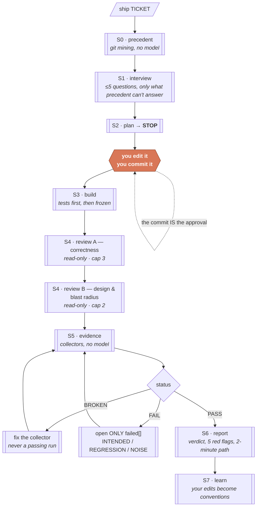

<div align="center">

# ship-harness

**Ticket → plan → build → two-model review → evidence → one page you actually read.**

Portable across repos and stacks. Everything is a file; nothing lives in a model's memory.

[](https://docs.claude.com/en/docs/claude-code/plugins)
[](LICENSE)
[](https://github.com/aryanmehrotra/ship-harness/actions/workflows/ci.yml)

</div>

---

## The problem this solves

An agent with a ticket will produce a diff. The diff will look reasonable. It will also
quietly invent a second way to do something the repo already does, review itself into
approval, and hand you a summary that says the tests pass.

None of those are model failures — they are structural. An agent that has never been shown
the repo's precedent has no reason to reuse it. An agent that knows the review loop ends when
it says APPROVED has a reason to say APPROVED. An agent asked to describe its own work will
describe it favourably.

`ship-harness` fixes them structurally:

| Failure | The structural answer |
|---|---|
| Reinvents what the repo already has | Precedent is mined from git **before** planning, and reuse is binding |
| Plans drift from what you actually wanted | The plan is a **committed file** — your commit is the approval gate |
| Reviews itself into approval | **Two different models**, read-only, capped, on fresh context |
| "Tests pass" as evidence | Deterministic **collectors** produce artifacts; the model only reads what already failed |
| Fixes the test instead of the bug | A **hook** freezes test files once review starts |
| State lives in a chat log | State lives in the tracker and `.evidence/` — any run can be killed and resumed |

## How it flows



## Install

**As a plugin** — updates in one place, works in every repo:

```bash
/plugin marketplace add aryanmehrotra/ship-harness
/plugin install ship-harness
```

To pick up a new version later:

```bash
/plugin marketplace update ship-harness   # then /plugin → update ship-harness
```

Every release is tagged `vX.Y.Z` with notes in
**[CHANGELOG.md](CHANGELOG.md)**; CI refuses a build where the tag, `plugin.json` and the
changelog disagree.

**Or vendored** — files in-tree, no plugin system needed:

```bash
bash install.sh /path/to/your/repo   # then merge the printed hook into .claude/settings.json
```

Then, once per repo:

```bash
/ship-harness:init          # detects your stack, writes ship.config.json, scaffolds docs/
/ship-harness:backfill      # builds docs/memory/ from git history — run once
```

## The daily loop

```
/ship-harness:ship T-123     → mines precedent, asks ≤5 questions, writes docs/plans/T-123.md, STOPS
<you edit it>                → fix what it got wrong. This is where you do your thinking.
git commit                   → this is the approval gate
/ship-harness:ship T-123     → build → review A → review B → evidence → report → issue comment
<you>                        → open one link
```

You are asked for judgement exactly twice: five questions, and one plan review. Everything
else is either deterministic or delegated.

## Evidence works for any stack

Screenshots are not the point — **a deterministic oracle** is. A collector is any executable
that answers "did observable behaviour change in a way nobody intended", and reports in one
shape.

| Bundled collector | Proves | Good for |
|---|---|---|
| `builtin:web-shots` | routes × widths × themes, pixel-diffed; console + network errors are hard failures | web apps |
| `builtin:http-pairs` | real request/response pairs, normalised and diffed | APIs, services, anything headless |
| `builtin:cmd-golden` | stdout, stderr and exit code against golden files | CLIs, codegen, formatters, migrations |
| `builtin:tests` | the raw, unsummarised test log, linked from the report | everything |

Writing your own is a dozen lines in any language — read the env vars, write one JSON file,
exit `0`/`1`/`2`. See **[collectors/CONTRACT.md](collectors/CONTRACT.md)**.

Two properties make this cheap enough to run on every change:

- **The model reads `failed[]`, never the artifact set.** Forty-eight screenshots cost the
  same as one when none of them regressed.
- **`BROKEN` is not `PASS`.** A collector that could not run — dead dev server, missing
  dependency — halts the pipeline instead of reporting a clean sweep. This is the single most
  expensive bug a harness like this can have, and it is the one most likely to go unnoticed.

## The four rules everything else serves

1. **The plan is the contract.** A committed file, not chat history — one screen, bullets
   and a required ASCII diagram, so it is still read at the moment it has to hold.
2. **Reviewers cannot edit. The fixer cannot touch tests.** Reviewers have no write tools at
   all; the test freeze is a `PreToolUse` hook. Neither is a request in a prompt.
3. **A deterministic gate runs before the model looks.** Pixel diffs, console errors, failed
   requests, exit codes. The model only ever looks at what already failed.
4. **State not in the tracker does not exist.** Kill any run at any point; the next one reads
   `.evidence/phase` and picks up.

## Caps, and why they exist

Review loops cap at 3 (round A) and 2 (round B); evidence-fix loops at 2.

An uncapped "review until approval" converges on approval. The reviewer knows the loop ends
when it says APPROVED, and that is enough. At the cap it stops and hands the open findings to
you, rather than agreeing with itself on round six.

Memory files have hard line caps for the same class of reason: adding a line is easy and
removing one takes judgement, so without a cap you get a 400-line file that nobody trusts and
everybody skims. The cap forces the merge-or-drop decision that otherwise never gets made.

## Known limits

**The visual judge is the weakest link.** Published benchmarks put VLM-vs-human agreement on
visual fidelity at roughly 0.66 Spearman against 0.78 human-to-human, with a documented bias
toward inflated scores. That is exactly why console errors and failed requests are hard
failures with no judgement call attached — they are the part that cannot be talked out of.

**Coverage is still your problem.** No diff engine catches a regression in a viewport, theme
or signed-in state the baseline never captured. Your collector config is the highest-leverage
file in the repo and no agent can write it for you.

**Git records what changed, not why.** `docs/memory/decisions.md` only accepts lines with
corroboration — a revert, a PR discussion, a postmortem. Everything else is filed as an
observed regularity with no rationale attached, because an invented rationale reads like
evidence and steers decisions it never supported.

**`docs/memory/` is derived and disposable.** If it goes weird, delete it and re-run the
backfill. Nothing may live only there.

## What's in the box

| Path | Does |
|---|---|
| `skills/ship/` | the pipeline, S0–S7 |
| `skills/init/` | per-repo setup: stack detection, config, scaffold, ignore rules |
| `skills/backfill/` · `skills/refresh/` | build `docs/memory` from history; verify and prune it monthly |
| `agents/reviewer-correctness.md` | round A — correctness. No write tools |
| `agents/reviewer-design.md` | round B — design, blast radius. No write tools |
| `hooks/phase-guard.sh` | freezes tests during review/fix; protects committed baselines |
| `collectors/` | the pluggable evidence layer + its contract |
| `scripts/collect.sh` | runs every collector, aggregates one verdict |
| `scripts/precedent-scan.sh` | deterministic git mining; no model |
| `scripts/tracker.sh` | GitHub / none adapter — four verbs |
| `templates/` | plan and ADR contracts, memory seeds, config presets |

## Docs

- **[Getting started](docs/getting-started.md)** — first run, end to end
- **[Evidence collectors](docs/evidence-collectors.md)** — configure the bundled ones, write your own
- **[Configuration](docs/configuration.md)** — every field in `ship.config.json`
- **[Design rules](docs/design-rules.md)** — why each constraint exists, and what breaks without it
- **[Trackers](docs/trackers.md)** — adding Jira, Linear, or anything else

## License

MIT — see [LICENSE](LICENSE).
